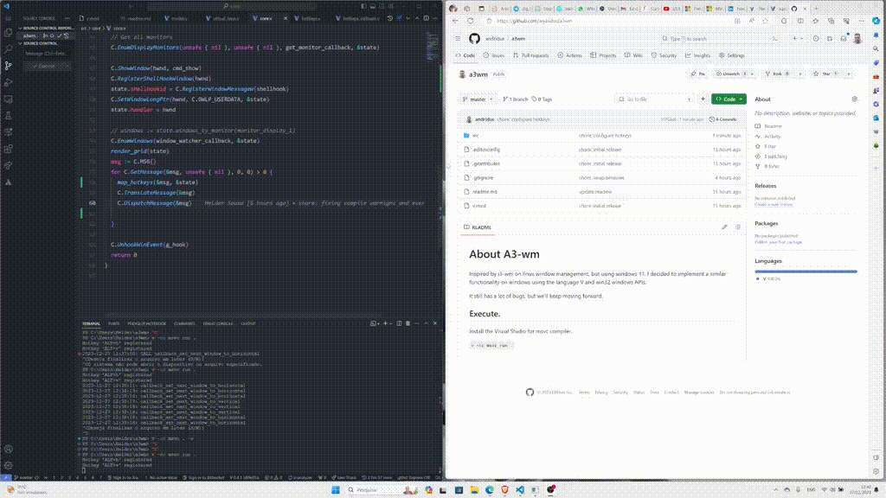

# About A3-wm
Inspired by i3-wm on linux window management, but using windows 11. I decided to implement a similar functionality on windows using the language V and win32 windows APIs.

It still has a lot of bugs, but we'll keep moving forward.

## To do
 - [x] multiple monitors
 - [x] adjust window side by side horizontally
 - [x] swap window position with other window
 - [x] attach new window to current grid horizontally
 - [x] adjust window side by side vertically
 - [x] add system tray
 - [] add popup options to system tray
 - [] add icon to system tray
 - [] attach new window to current grid vertically
 - [] add new window anywhere
 - [] drag and put window anywhere
 - [x] change grid direction
 - [x] set/unset window fullscreen
 - [] move between windows
 - [] create other workspaces
 - [] send window to other workspaces
 - [] add config file

## Keyboard Shortcuts
 ALT+t : toggle window direction (mouse pointer over)

## Example

## Execute.
install the Visual Studio for msvc compiler.

`v -cc msvc run .`
